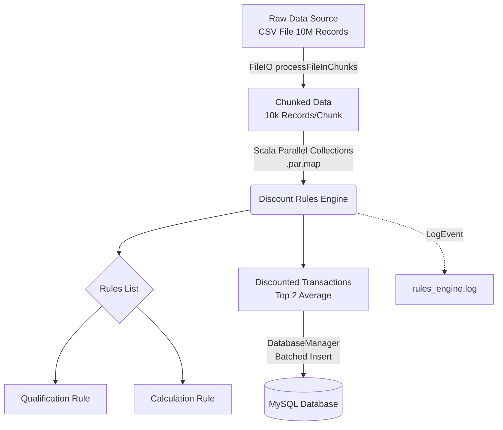
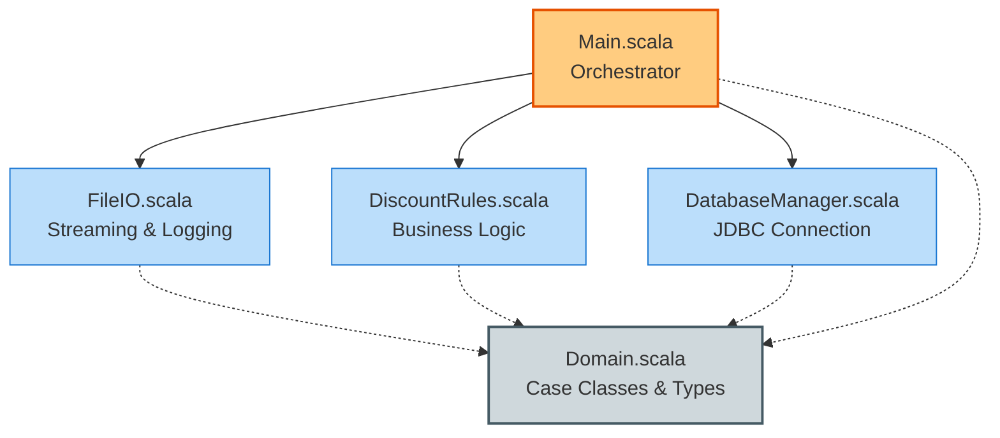

# Discount Rules Engine

A high-performance, functionally pure rule engine built in Scala, designed to process and evaluate retail transaction data against a complex set of discount rules. The system efficiently handles massive datasets by leveraging data chunking and parallel processing, ensuring robust performance and fault tolerance.

## Overview

Retail stores often need to apply various promotional discounts based on dynamic conditions such as product expiration, purchase dates, product categories, quantities, and payment methods. This project serves as a scalable rule-based engine that automatically qualifies transactions for these discounts, calculates the optimal price reductions, and ingests the processed records into a relational database.

The engine evaluates each transaction against all active rules. If a transaction qualifies for multiple discounts, it averages the top two highest discounts to determine the final price. Transactions that do not qualify for any discount are ignored during the final database load.

## Architecture

The system is built with a focus on functional programming paradigms and high-throughput data processing.



## Performance & Scaling

Handling millions of transactions requires specific architectural decisions to avoid memory exhaustion and maximize CPU utilization. The engine implements the following strategies:

*   **Chunking:** Reading a massive file entirely into memory is an anti-pattern that leads to OutOfMemory crashes. The `FileIO` module reads and processes the data stream in manageable chunks (e.g., 10,000 records per chunk). This keeps the memory footprint low and predictable regardless of the file size.
*   **Parallel Processing:** Evaluating multiple rules for thousands of records is computationally expensive. The system utilizes Scala's parallel collections (`.par.map`) to distribute the workload of each chunk across all available CPU cores. This drastically reduces processing time for large batches by executing the rules matrix simultaneously.

    ```mermaid
    flowchart TD
        A[10,000 Row Chunk] -->|Scala .par| B(Thread Dispatcher)
        
        B --> C1[CPU Core 1]
        B --> C2[CPU Core 2]
        B --> C3[CPU Core 3]
        B --> C4[CPU Core N]
        
        C1 -->|Calculate| D1{Rules 1-6}
        C2 -->|Calculate| D2{Rules 1-6}
        C3 -->|Calculate| D3{Rules 1-6}
        C4 -->|Calculate| D4{Rules 1-6}
        
        D1 --> E
        D2 --> E
        D3 --> E
        D4 --> E
        
        E(Thread Merge) -->|.toList| F[Processed List Output]
    ```
*   **Batched Database Inserts:** Writing records one by one to the database causes severe network and I/O bottlenecks. The `DatabaseManager` groups the processed and qualified transactions and executes batched inserts (`pstmt.addBatch()`, `pstmt.executeBatch()`), drastically improving throughput.

## Technical Design

The codebase strictly adheres to functional programming principles:

*   **Pure Functions:** All rule calculations and qualifications are implemented as pure functions. The output depends solely on the input transaction, without mutating any state or causing side effects.
*   **Immutability:** The engine uses immutable data structures and `val` declarations exclusively. No `var` loops are used.
*   **Functional Error Handling:** Interactions with the outside world (I/O, Database) are wrapped in `Try` monads. This allows the system to elegantly pattern match `Success` and `Failure` states without relying on traditional try-catch blocks.
*   **Rule Abstraction:** A rule is defined as a tuple of two functions: a qualifier (returns a Boolean) and a calculator (returns a Double). This abstraction makes it trivial to add, remove, or modify rules without touching the core engine logic.

## Component Architecture

The codebase is organized into distinct functional modules, maintaining a clear separation of concerns between I/O operations, business logic, and data definitions.



*   `Main.scala`: The application orchestrator. Coordinates file reading, parallel rule application, and database loading.
*   `DiscountRules.scala`: The core logic container. Houses all the individual qualification and calculation rules, and the final discount aggregation logic.
*   `Domain.scala`: Defines the core data structures, including the `Transaction` case class and the `Rule` type alias.
*   `FileIO.scala`: Handles reading the CSV files in chunks and appending to the system logs.
*   `DatabaseManager.scala`: Manages the JDBC MySQL connection, table initialization, and batched data ingestion.

## Setup and Execution

1.  Ensure you have an active MySQL instance running.
2.  Set the `DB_PASS` environment variable with your database password. The system expects a database named `iti-scala` and a user `root`.
3.  Place your transaction data file at `src/main/resources/TRX10M.csv`.
4.  Run `Main.scala` to start the processing pipeline.

The system will initialize the required database tables automatically, process the transactions, save the discounted records, and log its progress to `src/main/resources/rules_engine.log`.
